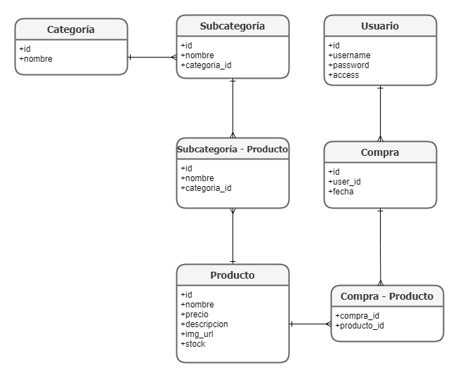

# Kusa Store

## Integrantes

```
- Jose de Lama Zegarra
- Alex Loja Zumaeta
- Esteban Villacorta Garcia
- Gustavo Orosco Zavala
```

## Descripción

Kusa store es una aplicación web de tienda online en la que se ofrecen productos relacionados al anime, manga y la cultura otaku en Perú.

El proyecto permite que existan tres tipos de usuario para la aplicación: administrador, cliente registrado y cliente no registrado. Cada uno tiene permisos incrementales dentro de la aplicación.

- Cliente no registrado:
  - Puede entrar a la pagina y ver los productos.
- Cliente registrado:
  - Puede añadir los productos que desea comprar a un carrito de compra.
  - Puede comprar estos productos.
- Administrador:
  - Puede hacer CRUD de los productos de manera sencilla, por medio de la interfaz.

## Objetivos Principales

```
- Venta legal de figuras coleccionables en Perú.
- Importación de artículos desde Japón.
- Impulso de la cultura otaku en Perú y América Latina.
```

## Mision

Ser la tienda virtual de manga, anime, artículos coleccionables más grande y reconocida en Perú.

## Vision

Ser referente en la construcción de la cultura otaku en sudámerica. "Una monita china en cada hogar".

## Tecnologias utilizadas

Para el desarrollo de Kusa Store se utilizó:

### FrontEnd

```
- HTML5 y CSS7
- Bootstrap y UIkit
- Javascript
```

### BackEnd


- [SQLAlchemy](https://www.sqlalchemy.org/) para el manejo a alto nivel de los modelos de bases de datos.
- [Flask](https://flask-sqlalchemy.palletsprojects.com/en/2.x/) como framework para la creación rápida de la aplicación web.
- [flask_wtf](https://flask-wtf.readthedocs.io/en/0.15.x/) para el manejo de forms en la compra de articulos.
- [Flask_login](https://flask-login.readthedocs.io/en/latest/) para el manejo y validación de usuarios y su acceso al sistema.
- [flask_migrate](https://flask-migrate.readthedocs.io/en/latest/) para tener un log de los cambios a la estructura de la base de datos.


### Bases de datos

```
- Postgresql a nivel interno en la creación de las Bases de datos
```

## Uso y Deployment

Para hacer uso de la aplicación, se deben seguir los siguientes pasos:

- Configurar las credenciales para la base de datos que se quiere usar en el archivo `config.py`.
- Instalar los requerimientos mostrados en el archivo `requirements.txt` dentro de este mismo repositorio.
- Ejecutar el comando:
  ```
  python app.py
  ```

### Inicializar registros

Hay registros de prueba que se pueden agregar mediante el script inicializardatabase.py. Solo se debe ejecutar:

```
python inicializardatabase.py
```

## Informacion de la aplicación

Dentro de las entidades en la aplicación (clases en el código y tablas en la base de datos) tenemos las siguientes:

```
- Usuario: representa a los usuarios registrados en la aplicación.
- Categoria: es la categoría a la que pertenece un producto.
- Subcategoría: similar a Categoría.
- Producto: un producto general disponible, con atributos como nombre, precio, descripcióń, etc.
- Compra: una compra hecha, con atributos como fecha, usuario y productos.
```

Estas tablas se relacionaran de la siguiente manera:


Además, existe un endpoint para cada vista de la página:

### Index

Es la vista principal de la página. Muestra todos los productos disponibles. Los clientes de la aplicacion pueden agregar objetos al carrito para comprarlos luego. Los administradores pueden controlar que productos se muestran a los clientes mediante otros métodos.

### Signup Cliente

Es un formulario que crea un usuario a partir de los datos del cliente. Revisa si el username ya se encuentra registrado y, si no, lo añade a la base de datos con SQLAlchemy. El url "/signup" implementa una interfaz amigable al usuario, donde se ingresan los parametros necesarios para la creacion de una cuena.

### Login Cliente

Es una vista que permite al usario loguearse a su cuenta, si esta existe. El cliente debe ingresar su usuario y contraseña para acceder. En caso el usuario con esas credenciales no exista en la base de datos, se muestra un mensaje de error al usuario pidiendo que se loguee de nuevo. En caso se valide, se crea una sesión persistente para el mismo, por lo que salir y volver a entrar a la página mantendrá su sesion abierta hasta desconectarse.

### Logout Cliente

Permite que un usuario logueado se desconecte de la pagina. En caso no hacerlo, entrar a la pagina de nuevo mantendrá abierta su sesión.

### Single Product

Es una vista para obtener el detalle de un solo producto, que se especifica mediante su id en la url query.

### Create Product

Permite crear un producto en la base de datos si eres un administrador. Se implementa en el route "/createproduct". Un usuario que sea no autorizado o que solo tenga nivel de cliente no es permitido de utilizar esta funcionalidad, y será redirigido a la pagina principal de intentarlo. Un administrador puede utilizar la interfaz gráfica para crear un nuevo producto, que requiere llenar los campos necesarios para agregarlo (nombre, precio, descripcion, stock disponible y url de la imagen). El producto agregado podrá ser visto por todos los usuarios en la pagina de compras.

### Delete Product

Permite eliminar un producto de la base de datos si eres un administrador. Se implementa directamente en el landing page para cualquier administrador. Un administrador puede eliminar un producto clickeando en la x que aparecerá en la parte superior derecha de su nombre. Otros clientes que no sean administradores simplemente no implementan la funcionalidad, y no podrán ver rastro de ella.

### Update Product

Permite actualizar la información de un producto ya existente si eres un administrador. Es implementado de forma similar a createproduct, pero solo el nombre del producto es requerido. Cualquier campo vacio no es modificado. Cualquier dato en un campo llenado reemplaza la data en el producto quee tenga como nombre el nombre deseado.

### Server error

Vista para mostrar lo que se muestra cuando ocurre un server error, para evitar matar el servidor. Permite redirigir al usuario al landing page en caso ocurra un evento anormal (e.g., si la conexion al servidor cae).
